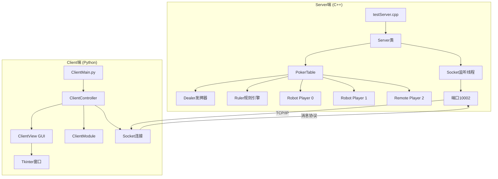
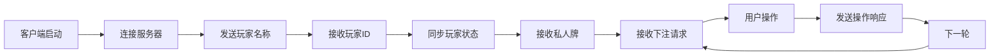
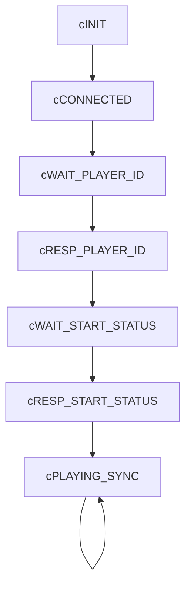
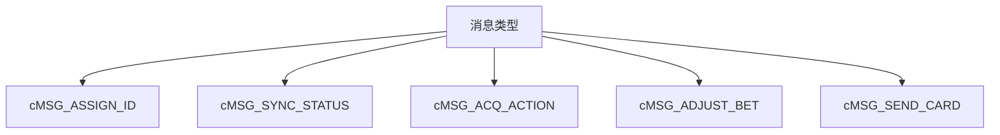
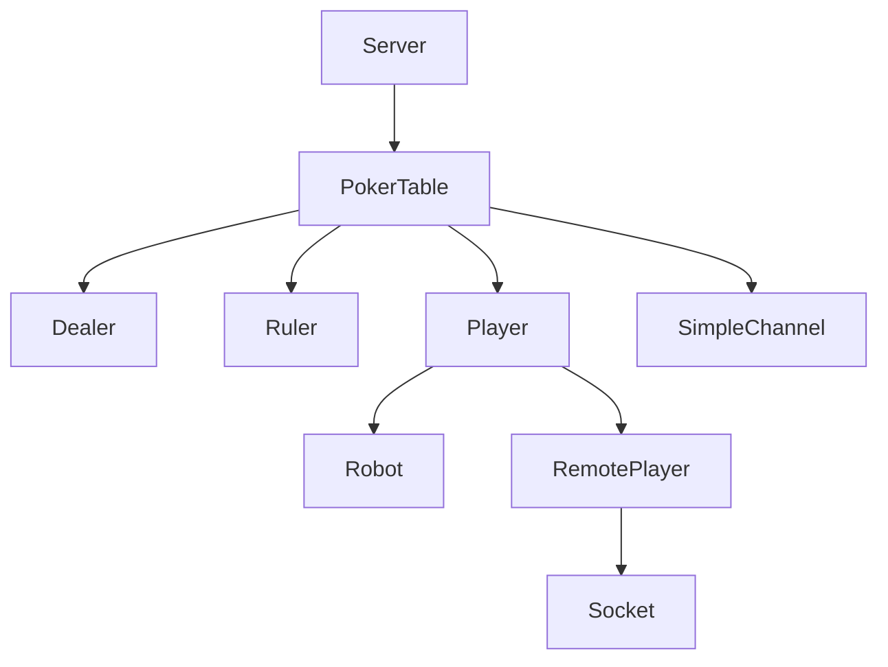
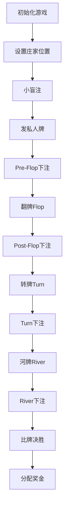
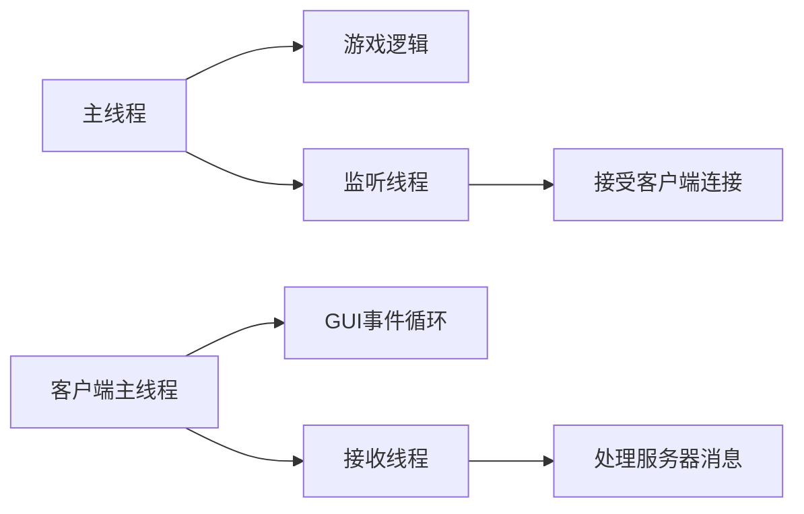
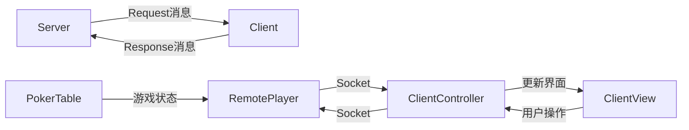
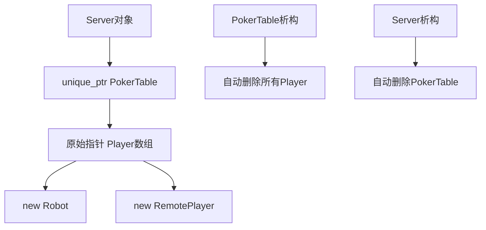

# 德州扑克系统架构文档

## 系统架构图

## 通信流程图

## 状态机图

## 消息协议类型

## 类关系图

## 游戏流程图

## 线程模型

## 数据流向

## 内存管理模型

## 核心类职责

### Server类
- Socket监听和连接管理
- 多线程控制
- PokerTable生命周期管理

### PokerTable类
- 游戏流程控制
- 玩家管理
- 下注循环
- 获胜判定

### Dealer类
- 洗牌
- 发牌(私人牌、公共牌)
- 牌堆管理

### Ruler类
- 牌力计算
- 规则判定
- 大小比较

### Player类
- 玩家状态
- 筹码管理
- 操作接口

### ClientController类
- 网络通信
- 状态管理
- 消息处理
- View控制

### ClientView类
- GUI渲染
- 用户交互
- 状态显示

## 技术栈

### 服务器端
- **语言**: C++11
- **网络**: POSIX Socket
- **线程**: pthread
- **内存管理**: unique_ptr, atomic
- **编译**: g++/clang++

### 客户端
- **语言**: Python 3
- **GUI**: Tkinter
- **网络**: socket模块
- **线程**: threading模块

## 配置参数

| 参数 | 值 | 说明 |
|------|---|------|
| 服务器IP | 127.0.0.1 | 本地测试 |
| 服务器端口 | 10002 | TCP监听端口 |
| 最大玩家数 | 8 | PokerTable::cMaxPlayerCount |
| 小盲注 | 5 | PokerTable::cBlindBet |
| 初始筹码 | 500 | gPlayerInitBet |
| 消息缓冲区 | 1024 | Server::MsgBufferLen |

## 部署方式

1. 编译服务器: `cd Server && make`
2. 启动服务器: `./server.out`
3. 启动客户端: `python3 ClientMain.py`
4. 在GUI界面进行游戏操作
